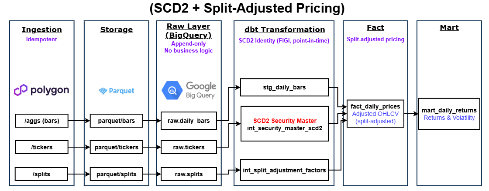
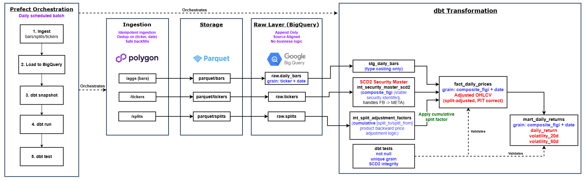

# Financial Data Pipeline

## Project Summary
This project is a production-oriented financial data pipeline for point-in-time correct analytics:

Key capabilities:
* Idempotent ingestion from Polygon with safe re-runs and overlap backfills
* SCD2 security master for stable identity across ticker changes (`composite_figi`)
* Explicit split-adjusted pricing using cumulative adjustment factors
* Deterministic batch pipeline (Parquet → BigQuery → dbt)

The pipeline is designed for reproducibility, correctness, and safe historical reprocessing.
## Architecture

The system separates ingestion, storage, and transformation to enforce correctness and reproducibility. Raw data is first written to canonical parquet datasets, then loaded into an append-only BigQuery raw layer free of business logic. 



Transformations are implemented in dbt across staging, intermediate, and mart layers. The `composite_figi` is used instead of `ticker` to maintain identity across time, and an SCD2 snapshot tracks changes in ticker metadata. Split adjustments are computed explicitly in an intermediate layer and applied downstream to produce point-in-time correct prices. This layered design ensures idempotent ingestion, deterministic transformations, and reproducible analytical outputs. 


## Key Design Decisions
* **Unadjusted prices + explicit adjustment layer**
  Raw OHLCV data is stored unmodified, and split adjustments are applied downstream using cumulative factors. This avoids reliance on vendor-adjusted data, which is often opaque and inconsistent across providers.

* **SCD2 security master (composite FIGI)**
  Tickers are not stable identifiers (e.g. FB → META). A slowly changing dimension keyed on `composite_figi` preserves security identity over time and enables correct point-in-time joins.

* **Idempotent ingestion**
  Ingestion is designed to support safe reruns and overlapping backfills via dedup on `(ticker, date)`. This ensures that the pipeline is repeatable and does not introduce data drift.

* **Intermediate layer separation**
  Business logic such as split adjustment is isolated in the intermediate layer instead of staging or fact models. This keeps transformations testable and easier to validate.


## Tradeoffs

* **Batch over streaming** — simplifies correctness and reproducibility at the cost of latency. For daily OHLCV data, sub-day freshness is not required.
* **BigQuery over OLTP stores** — optimized for analytical workloads and native dbt integration. Not suited for low-latency serving.
* **Parquet canonical layer** — enables reproducibility and re-ingestion from source of truth, but adds storage duplication.
* **Full-refresh dbt models** — simpler transformation logic and easier debugging, but not yet optimized for large-scale datasets.

##  Data Model

Core grains:

| Layer | Model | Grain |
|---|---|---|
| Staging | `stg_daily_bars` | `(symbol, timestamp)` |
| Intermediate | `int_split_adjustment_factors` | `(composite_figi, price_date)` |
| Snapshot | `int_security_master_scd2` | `(composite_figi, dbt_valid_from, dbt_valid_to)` |
| Mart | `fact_daily_prices` | `(composite_figi, price_date)` |
| Mart | `mart_daily_returns` | `(composite_figi, price_date)` |

All downstream joins use `composite_figi` for identity and SCD2 validity windows for point-in-time correctness.


## Data Quality Guarantees

Data quality is enforced through dbt tests at multiple layers:

* **Schema tests** enforce:

  * Not null constraints on key fields
  * Uniqueness at grain level (e.g. `composite_figi + date`)

* **Custom tests** validate:

  * SCD2 integrity (no overlapping validity windows per FIGI)
  * Correct grain enforcement in fact tables
  * No duplicate records after transformations

15 tests currently pass across staging, intermediate, and mart layers, ensuring that the dataset is structurally and temporally consistent.

## Quick Start

### 1. Configure `.env`

```env
POLYGON_API_KEY=YOUR_API_KEY
GOOGLE_CLOUD_PROJECT=GOOGLE_CLOUD_PROJECT_ID
BQ_DATASET_ID=BIG_QUERY_DATASET_ID
GOOGLE_APPLICATION_CREDENTIALS=PATH_TO_CREDENTIALS_JSON
```
### 2. Set up import list
Add tickers to import in `symbols.txt` for universe of stocks.

### 3. Run tests
```bash
python -m pytest -q
cd warehouse && dbt test
```

### 4. Run Pipeline
```bash
# Run the full pipeline
cd flows
python -m pipeline_flow
```

## Repository Structure
```text
src/
  financial_data_pipeline/
    cli.py
    config.py
    load_bq.py
    orchestrator.py
    polygon.py
    transforms.py
flows/
  pipeline_flow.py

warehouse/
  staging/
  intermediate/
  marts/
  snapshots/
  tests/

data/
  raw parquet datasets (per symbol)

docs/
  architecture diagrams

tests/
  pytest coverage for ingestion + validation
  ```

## Current Limitations / Future Work

- SCD2 historical reconstruction:
  Current implementation builds forward from initial snapshot. Full historical reconstruction is a known extension.

- Corporate actions:
  Split adjustments implemented; dividends and total return modeling are planned.

- Incremental modeling:
  Current dbt models use full refresh for simplicity. Incremental strategies will be introduced for scalability.

- Macro data integration:
  FRED integration planned for multi-factor analysis.